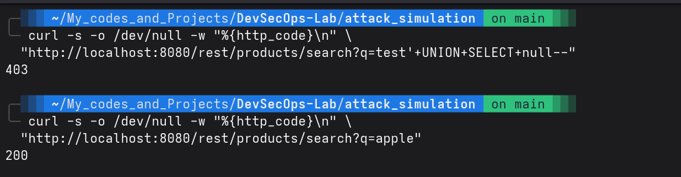
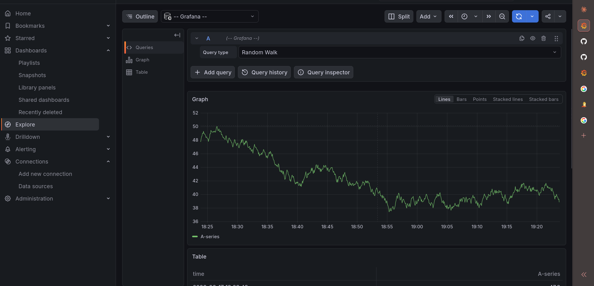
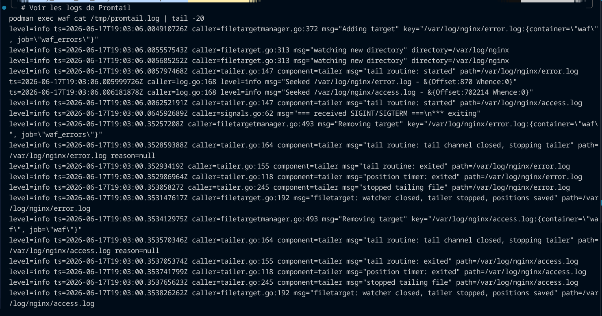

# 🛡️ DevSecOps Web Lab

[](https://www.terraform.io/)
[](https://www.ansible.com/)
[](https://coreruleset.org/)
[](https://grafana.com/)
[](https://www.mysql.com/)
[](LICENSE)

> **Déploiement automatisé d'une stack web sécurisée avec WAF, monitoring SOC et simulation de kill chain.**

---

## 📋 Table des matières

- [Aperçu](#-aperçu)
- [Architecture](#-architecture)
- [Stack technique](#-stack-technique)
- [Prérequis](#-prérequis)
- [Déploiement rapide](#-déploiement-rapide)
- [Simulation d'attaque (Kill Chain)](#-simulation-dattaque-kill-chain)
- [Monitoring SOC](#-monitoring-soc)
- [Structure du projet](#-structure-du-projet)
- [Problèmes rencontrés](#-problèmes-rencontrés)
- [Documentation](#-documentation)

---

## 🎯 Aperçu

Ce laboratoire DevSecOps déploie une infrastructure web complète **100% locale** avec **Docker/Podman**, sécurisée par un **WAF (ModSecurity + OWASP CRS)**, supervisée par une **stack Grafana/Loki**, et testée par des **simulations d'attaque** couvrant l'OWASP Top 10 2025.

**Objectif portfolio SOC Analyst** : démontrer la capacité à déployer, configurer, attaquer, détecter et remédier des incidents de sécurité dans un environnement conteneurisé.

### Ce que le projet démontre

- ✅ **IaC complet** : Terraform + Ansible, tout est versionné et reproductible
- ✅ **WAF en production** : 846 règles OWASP CRS, blocage effectif (403)
- ✅ **Durcissement MySQL** : Politique de mots de passe, SSL/TLS, moindre privilège
- ✅ **Monitoring SOC** : Dashboard Grafana avec requêtes LogQL temps réel
- ✅ **Kill chain réaliste** : Reconnaissance → SQLi → XSS → Path Traversal
- ✅ **Gestion des secrets** : Variables sensibles chiffrées avec Ansible Vault
- ✅ **Troubleshooting documenté** : 12 problèmes réels avec Root Cause Analysis

---

## 🏗️ Architecture

```
┌──────────────────────────────────────────────────────────────────┐
│                        Hôte Linux (Podman)                       │
│  ┌────────────────────────────────────────────────────────────┐  │
│  │                    devsecops-net                            │  │
│  │                                                             │  │
│  │  ┌──────────┐    ┌──────────────┐    ┌────────────────┐    │  │
│  │  │          │    │              │    │                │    │  │
│  │  │  WAF     │───>│  Juice Shop  │───>│    MySQL 8.0   │    │  │
│  │  │  :8080   │    │  :3000       │    │    :3306       │    │  │
│  │  │  Nginx + │    │  (vulnérable)│    │    (durci)     │    │  │
│  │  │  ModSec  │    │              │    │                │    │  │
│  │  └────┬─────┘    └──────────────┘    └────────────────┘    │  │
│  │       │                                                     │  │
│  │  ┌────▼─────┐    ┌──────────────┐    ┌────────────────┐    │  │
│  │  │ Promtail │───>│    Loki      │<───│    Grafana     │    │  │
│  │  │(:inside) │    │   :3100      │    │   :3001        │    │  │
│  │  └──────────┘    └──────────────┘    └────────────────┘    │  │
│  └────────────────────────────────────────────────────────────┘  │
└──────────────────────────────────────────────────────────────────┘
```

*Schéma détaillé avec diagramme Mermaid : [`docs/architecture.md`](docs/architecture.md)*

---

## ⚙️ Stack technique

| Domaine | Technologie | Version |
|---------|-------------|---------|
| **Infrastructure as Code** | Terraform + Provider Docker | ~> 3.0 |
| **Configuration Management** | Ansible + Ansible Vault | Dernière |
| **Conteneurisation** | Podman (rootless) | Dernière |
| **Application cible** | OWASP Juice Shop | latest |
| **WAF** | Nginx + ModSecurity 3 + OWASP CRS | 1.30.1 / 3.0.15 |
| **Base de données** | MySQL 8.0 | 8.0 |
| **Monitoring** | Grafana + Loki + Promtail | 13.0.2 / latest |
| **Attaque** | SQLMap + Nmap | Dernière |

---

## 📦 Prérequis

- **Linux** (testé sur Fedora / Debian / Arch)
- **Podman** (ou Docker) avec le socket activé
- **Terraform** ≥ 1.5
- **Ansible** ≥ 2.15
- **Python 3** + pip/pipx

Installation automatisée :

```bash
chmod +x tests.sh && ./tests.sh
```

---

## 🚀 Déploiement rapide

```bash
# 1. Provisionner l'infrastructure (5 conteneurs)
terraform -chdir=terraform apply

# 2. Configurer WAF + DB + Monitoring
ansible-playbook ansible/playbooks/site.yml --ask-vault-pass

# 3. Vérifier que tout tourne
podman ps
```

### Accès aux services

| Service | URL | Identifiants |
|---------|-----|--------------|
| **WAF (Juice Shop)** | [http://localhost:8080](http://localhost:8080) | — |
| **Grafana** | [http://localhost:3001](http://localhost:3001) | `admin` / `as-you-go` |
| **Loki** | [http://localhost:3100](http://localhost:3100) | — (API) |

---

## ⚔️ Simulation d'attaque (Kill Chain)

```bash
cd attack_simulation && bash simulate_killchain.sh
```

Le script exécute 5 phases couvrant l'**OWASP Top 10 2025** :

| Phase | Catégorie OWASP 2025 | Technique | Résultat attendu |
|-------|----------------------|-----------|-----------------|
| **Reconnaissance** | A02 Security Misconfiguration | Scan de chemins sensibles | 403 sur /phpinfo.php, /.git |
| **SQL Injection** | A05 Injection | OR 1=1, UNION SELECT, DROP TABLE | **403 bloqué** |
| **XSS** | A05 Injection | Script alert, version encodée | **403 bloqué** |
| **Path Traversal** | A01 Broken Access Control | /../../etc/passwd | 200 (chemin normalisé) |
| **Faux positif** | WAF Tuning | Recherche O'Reilly | 500 (erreur app) |

### Résultat attendu

```
[PHASE 1] Reconnaissance (A02 Security Misconfiguration)
  /phpinfo.php → HTTP 403   ← informations serveur protégées
  /.git/config → HTTP 403   ← repository exposé protégé

[PHASE 2] SQL Injection (A05 Injection)
  Payload : OR 1=1 → HTTP 403   ← WAF bloque

[PHASE 3] Cross-Site Scripting (XSS) (A05 Injection)
  Payload : script alert → HTTP 403   ← WAF bloque
```



---

## 📊 Monitoring SOC

### Dashboard Grafana

Un dashboard **Security Overview** avec 3 panels est préconfiguré :

1. **Volume de logs WAF** — time series de toutes les requêtes
2. **Requêtes bloquées (403)** — time series des blocages (en rouge)
3. **Top URIs attaquées** — bar chart horizontal des cibles les plus visées

### Requêtes LogQL utilisées

```logql
# Volume total de logs
count_over_time({job="waf"} [$__interval])

# Requêtes bloquées
count_over_time({job="waf"} |= "403" [$__interval])

# Top URIs attaquées (classement)
topk(10, sum by (uri) (count_over_time({job="waf"} |= "403" | json | __error__="" [$__interval])))
```



### Pipeline de logs

```
WAF (Nginx logs JSON) → Volume waf-logs → Promtail → Loki → Grafana
```



---

## 📁 Structure du projet

```
devsecops-web-lab/
│
├── terraform/                         # Infrastructure as Code
│   ├── main.tf                        # 5 conteneurs, réseau, volumes
│   ├── variables.tf                   # Variables sensibles
│   ├── outputs.tf                     # URLs de sortie
│   └── grafana_provisioning/          # Provisioning Grafana (IaC)
│       ├── datasources/loki.yml
│       └── dashboards/
│           ├── dashboard_provider.yml
│           └── security_overview.json
│
├── ansible/                           # Configuration Management
│   ├── ansible.cfg
│   ├── inventory.ini
│   ├── playbooks/
│   │   ├── site.yml                   # Playbook maître
│   │   ├── setup-python.yml           # Bootstrap Python
│   │   ├── waf-setup.yml              # Nginx + ModSecurity + Promtail
│   │   ├── db-hardening.yml           # Durcissement MySQL
│   │   └── monitoring.yml             # Vérification pipeline
│   ├── files/
│   │   ├── waf/                       # Config WAF (Nginx, ModSecurity)
│   │   └── promtail/                  # Config Promtail
│   └── group_vars/all/
│       ├── vars.yml                   # Variables normales
│       └── vault.yml                  # Variables chiffrées
│
├── attack_simulation/
│   └── simulate_killchain.sh          # Kill chain automatisée
│
├── grafana/dashboards/
│   └── security-dashboard.json        # Dashboard exporté
│
├── docs/
│   ├── architecture.md               # Schéma et détails d'architecture
│   ├── incident-report.md            # Rapport d'incident SOC
│   ├── ISSUES.md                     # Troubleshooting (12 problèmes)
│   ├── Resources.md                  # Documentation et références
│   └── evidences/                    # Captures d'écran
│       ├── Sqli-bloque.png
│       ├── Containers.png
│       ├── pipeline-valide.png
│       └── ...
│
├── tests.sh                          # Script d'installation des dépendances
└── README.md                         # Cette page
```

---

## 🔧 Problèmes rencontrés

12 incidents documentés dans [`docs/ISSUES.md`](docs/ISSUES.md) avec analyse de cause racine :

| # | Problème | Solution |
|---|----------|----------|
| 1 | Permission denied logs WAF | Bind mount → Volume Docker nommé |
| 2 | Connection reset by peer | Port interne 80 → 8080 |
| 3 | Python absent des conteneurs | Bootstrap avec module `raw` |
| 4 | Syntaxe Nginx (backslash) | Suppression du caractère d'échappement |
| 5 | Variable ModSecurity inconnue | Retrait du log_format propriétaire |
| 6 | pkill/pgrep introuvables | Installation de procps |
| 7 | Logs symlinkés vers /dev/stdout | Remplacement par de vrais fichiers |
| 8 | Mot de passe MySQL vault incorrect | Alignement Terraform/Ansible |
| 9 | Plugin audit_log absent (Community) | Alternative validate_password |
| 10 | Secrets exposés via podman inspect | Documentation des bonnes pratiques |
| 11 | Provisioning Grafana échoué | Configuration manuelle de la datasource |
| 12 | WAF ne bloque rien (200 au lieu de 403) | `SecRuleEngine On` + `SecDefaultAction deny` |

---

## 📚 Documentation

| Document | Description |
|----------|-------------|
| [`docs/architecture.md`](docs/architecture.md) | Schéma d'architecture et flux de données |
| [`docs/incident-report.md`](docs/incident-report.md) | Rapport d'incident SOC (kill chain + remédiation) |
| [`docs/ISSUES.md`](docs/ISSUES.md) | Troubleshooting détaillé (12 entrées) |
| [`docs/Resources.md`](docs/Resources.md) | Sources, documentations et références |

---

## 🧪 Le projet est terminé. Voici des pistes d'améliorations possibles

- Intégration pipeline CI/CD (GitHub Actions) pour apply automatique
- Scan de vulnérabilités des images avec Trivy
- Règles d'exclusion CRS avancées pour les faux positifs
- Alerting Grafana par email/Slack sur les pics de blocage

---

## 📄 Licence

MIT — voir le fichier [LICENSE](LICENSE).

---

*Projet réalisé dans le cadre d'une démarche d'apprentissage et de démonstration de compétences DevSecOps / SOC Analyst.*
