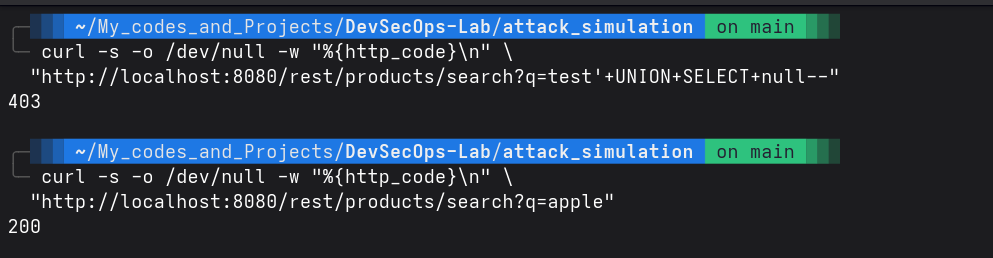
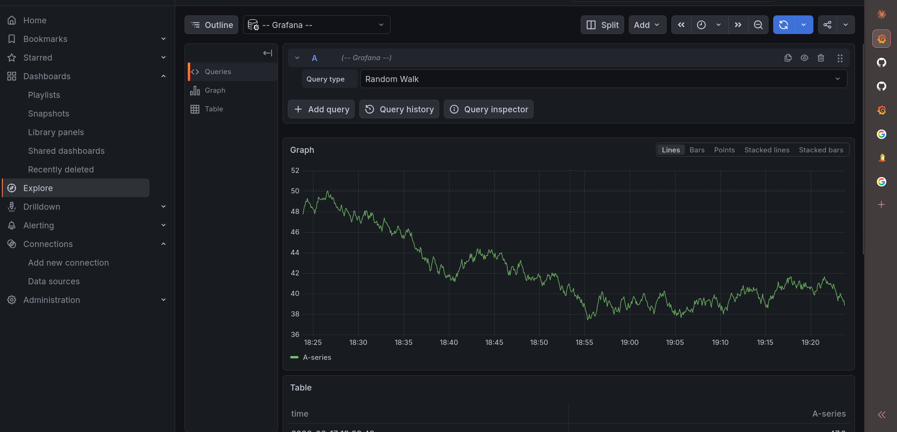
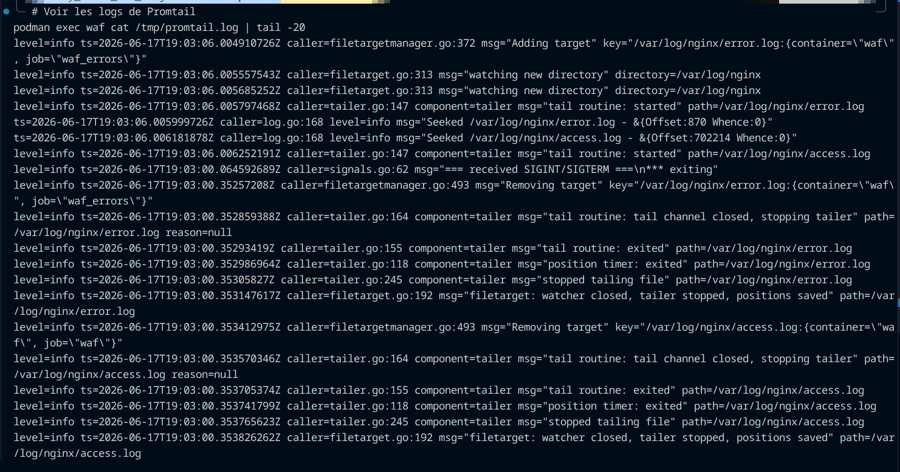

# 🛡️ DevSecOps Web Lab

[](https://www.terraform.io/)
[](https://www.ansible.com/)
[](https://coreruleset.org/)
[](https://grafana.com/)
[](https://www.mysql.com/)
[](LICENSE)

> **Automated deployment of a secure web stack with WAF, SOC monitoring and kill chain simulation.**

---

## 📋 Table of Contents

- [Overview](#-overview)
- [Architecture](#-architecture)
- [Tech Stack](#-tech-stack)
- [Prerequisites](#-prerequisites)
- [Quick Start](#-quick-start)
- [Attack Simulation (Kill Chain)](#-attack-simulation-kill-chain)
- [SOC Monitoring](#-soc-monitoring)
- [Project Structure](#-project-structure)
- [Troubleshooting](#-troubleshooting)
- [Documentation](#-documentation)

---

## 🎯 Overview

This DevSecOps lab deploys a complete web infrastructure **100% locally** with **Docker/Podman**, secured by a **WAF (ModSecurity + OWASP CRS)**, supervised by a **Grafana/Loki stack**, and tested by **attack simulations** covering OWASP Top 10 2025.

**Portfolio Objective for SOC Analyst**: demonstrate the ability to deploy, configure, attack, detect and remediate security incidents in a containerized environment.

### What the project demonstrates

- ✅ **Complete IaC**: Terraform + Ansible, everything is versioned and reproducible
- ✅ **Production WAF**: 846 OWASP CRS rules, effective blocking (403)
- ✅ **MySQL Hardening**: Password policy, SSL/TLS, least privilege
- ✅ **SOC Monitoring**: Grafana dashboard with real-time LogQL queries
- ✅ **Realistic Kill Chain**: Reconnaissance → SQLi → XSS → Path Traversal
- ✅ **Secret Management**: Sensitive variables encrypted with Ansible Vault
- ✅ **Documented Troubleshooting**: 12 real problems with Root Cause Analysis

---

## 🏗️ Architecture

```
┌──────────────────────────────────────────────────────────────────┐
│                        Linux Host (Podman)                       │
│  ┌────────────────────────────────────────────────────────────┐  │
│  │                    devsecops-net                            │  │
│  │                                                             │  │
│  │  ┌──────────┐    ┌──────────────┐    ┌────────────────┐    │  │
│  │  │          │    │              │    │                │    │  │
│  │  │  WAF     │───>│  Juice Shop  │───>│    MySQL 8.0   │    │  │
│  │  │  :8080   │    │  :3000       │    │    :3306       │    │  │
│  │  │  Nginx + │    │  (vulnerable)│    │    (hardened)  │    │  │
│  │  │  ModSec  │    │              │    │                │    │  │
│  │  └────┬─────┘    └──────────────┘    └────────────────┘    │  │
│  │       │                                                     │  │
│  │  ┌────▼─────┐    ┌──────────────┐    ┌────────────────┐    │  │
│  │  │ Promtail │───>│    Loki      │<───│    Grafana     │    │  │
│  │  │(:inside) │    │   :3100      │    │   :3001        │    │  │
│  │  └──────────┘    └──────────────┘    └────────────────┘    │  │
│  └────────────────────────────────────────────────────────────┘  │
└──────────────────────────────────────────────────────────────────┘
```

*Detailed diagram with Mermaid: [docs/architecture.md](docs/architecture.md)*

---

## ⚙️ Tech Stack

| Domain | Technology | Version |
|--------|-------------|---------|
| **Infrastructure as Code** | Terraform + Provider Docker | ~> 3.0 |
| **Configuration Management** | Ansible + Ansible Vault | Latest |
| **Containerization** | Podman (rootless) | Latest |
| **Target Application** | OWASP Juice Shop | latest |
| **WAF** | Nginx + ModSecurity 3 + OWASP CRS | 1.30.1 / 3.0.15 |
| **Database** | MySQL 8.0 | 8.0 |
| **Monitoring** | Grafana + Loki + Promtail | 13.0.2 / latest |
| **Attack Simulation** | SQLMap + Nmap | Latest |

---

## 📦 Prerequisites

- **Linux** (tested on Fedora / Debian / Arch)
- **Podman** (or Docker) with socket enabled
- **Terraform** ≥ 1.5
- **Ansible** ≥ 2.15
- **Python 3** + pip/pipx

Automated installation:

```bash
chmod +x tests.sh && ./tests.sh
```

---

## 🚀 Quick Start

```bash
# 1. Provision infrastructure (5 containers)
terraform -chdir=terraform apply

# 2. Configure WAF + DB + Monitoring
ansible-playbook ansible/playbooks/site.yml --ask-vault-pass

# 3. Verify everything is running
podman ps
```

### Service Access

| Service | URL | Credentials |
|---------|-----|-------------|
| **WAF (Juice Shop)** | [http://localhost:8080](http://localhost:8080) | — |
| **Grafana** | [http://localhost:3001](http://localhost:3001) | `admin` / `as-you-go` |
| **Loki** | [http://localhost:3100](http://localhost:3100) | — (API) |

---

## ⚔️ Attack Simulation (Kill Chain)

```bash
cd attack_simulation && bash simulate_killchain.sh
```

The script executes 5 phases covering the **OWASP Top 10 2025**:

| Phase | OWASP 2025 Category | Technique | Expected Result |
|-------|----------------------|-----------|-----------------|
| **Reconnaissance** | A02 Security Misconfiguration | Scan for sensitive paths | 403 on /phpinfo.php, /.git |
| **SQL Injection** | A05 Injection | OR 1=1, UNION SELECT, DROP TABLE | **403 blocked** |
| **XSS** | A05 Injection | Script alert, encoded version | **403 blocked** |
| **Path Traversal** | A01 Broken Access Control | /../../etc/passwd | 200 (normalized path) |
| **False Positive** | WAF Tuning | O'Reilly search | 500 (app error) |

### Expected Result

```
[PHASE 1] Reconnaissance (A02 Security Misconfiguration)
  /phpinfo.php → HTTP 403   ← server information protected
  /.git/config → HTTP 403   ← exposed repository protected

[PHASE 2] SQL Injection (A05 Injection)
  Payload : OR 1=1 → HTTP 403   ← WAF blocks

[PHASE 3] Cross-Site Scripting (XSS) (A05 Injection)
  Payload : script alert → HTTP 403   ← WAF blocks
```



---

## 📊 SOC Monitoring

### Grafana Dashboard

A **Security Overview** dashboard with 3 panels is pre-configured:

1. **WAF Log Volume** — time series of all requests
2. **Blocked Requests (403)** — time series of blocks (in red)
3. **Top Attacked URIs** — horizontal bar chart of most-targeted endpoints

### LogQL Queries Used

```logql
# Total log volume
count_over_time({job="waf"} [$__interval])

# Blocked requests
count_over_time({job="waf"} |= "403" [$__interval])

# Top attacked URIs (ranking)
topk(10, sum by (uri) (count_over_time({job="waf"} |= "403" | json | __error__="" [$__interval])))
```



### Log Pipeline

```
WAF (Nginx logs JSON) → waf-logs volume → Promtail → Loki → Grafana
```



---

## 📁 Project Structure

```
devsecops-web-lab/
│
├── terraform/                         # Infrastructure as Code
│   ├── main.tf                        # 5 containers, network, volumes
│   ├── variables.tf                   # Sensitive variables
│   ├── outputs.tf                     # Output URLs
│   └── grafana_provisioning/          # Grafana provisioning (IaC)
│       ├── datasources/loki.yml
│       └── dashboards/
│           ├── dashboard_provider.yml
│           └── security_overview.json
│
├── ansible/                           # Configuration Management
│   ├── ansible.cfg
│   ├── inventory.ini
│   ├── playbooks/
│   │   ├── site.yml                   # Master playbook
│   │   ├── setup-python.yml           # Python bootstrap
│   │   ├── waf-setup.yml              # Nginx + ModSecurity + Promtail
│   │   ├── db-hardening.yml           # MySQL hardening
│   │   └── monitoring.yml             # Pipeline verification
│   ├── files/
│   │   ├── waf/                       # WAF config (Nginx, ModSecurity)
│   │   └── promtail/                  # Promtail config
│   └── group_vars/all/
│       ├── vars.yml                   # Normal variables
│       └── vault.yml                  # Encrypted variables
│
├── attack_simulation/
│   └── simulate_killchain.sh          # Automated kill chain
│
├── grafana/dashboards/
│   └── security-dashboard.json        # Exported dashboard
│
├── docs/
│   ├── architecture.md               # Architecture diagram and details
│   ├── incident-report.md            # SOC incident report
│   ├── ISSUES.md                     # Troubleshooting (12 problems)
│   ├── Resources.md                  # Documentation and references
│   └── evidences/                    # Screenshots
│       ├── Sqli-bloque.png
│       ├── Containers.png
│       ├── pipeline-valide.png
│       └── ...
│
├── tests.sh                          # Dependency installation script
└── README.md                         # This page
```

---

## 🔧 Troubleshooting

12 documented incidents in [docs/ISSUES.md](docs/ISSUES.md) with root cause analysis:

| # | Problem | Solution |
|---|---------|----------|
| 1 | Permission denied logs WAF | Bind mount → Named Docker volume |
| 2 | Connection reset by peer | Internal port 80 → 8080 |
| 3 | Python missing from containers | Bootstrap with `raw` module |
| 4 | Nginx syntax error (backslash) | Remove escape character |
| 5 | Unknown ModSecurity variable | Remove proprietary log_format |
| 6 | pkill/pgrep not found | Install procps |
| 7 | Logs symlinked to /dev/stdout | Replace with real files |
| 8 | Incorrect MySQL vault password | Align Terraform/Ansible |
| 9 | audit_log plugin missing (Community) | Alternative validate_password |
| 10 | Secrets exposed via podman inspect | Document best practices |
| 11 | Grafana provisioning failed | Manual datasource configuration |
| 12 | WAF blocks nothing (200 instead of 403) | `SecRuleEngine On` + `SecDefaultAction deny` |

---

## 📚 Documentation

| Document | Description |
|----------|-------------|
| [docs/architecture.md](docs/architecture.md) | Architecture diagram and data flow |
| [docs/incident-report.md](docs/incident-report.md) | SOC incident report (kill chain + remediation) |
| [docs/ISSUES.md](docs/ISSUES.md) | Detailed troubleshooting (12 entries) |
| [docs/Resources.md](docs/Resources.md) | Sources, documentation and references |

---

## 🧪 Project is complete. Possible improvements

- CI/CD pipeline integration (GitHub Actions) for automatic apply
- Container image vulnerability scanning with Trivy
- Advanced CRS exclusion rules for false positives
- Grafana alerting via email/Slack on blocking spikes

---

## 📄 License

MIT — see [LICENSE](LICENSE) file.

---

*Project completed as part of a DevSecOps / SOC Analyst learning and skill demonstration initiative.*
