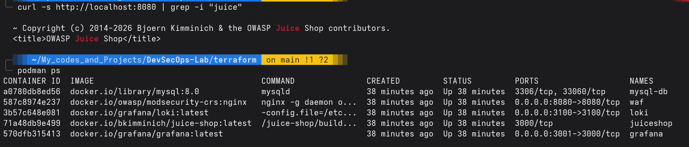
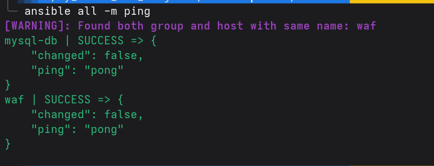

# Problèmes Rencontrés & Résolutions (Troubleshooting)

Ce document retrace les erreurs majeures rencontrées durant le déploiement et détaille la démarche de résolution (Root Cause Analysis). 

---

## 1. WAF : Nginx "Permission denied" sur les logs

### Le problème exact
Lors du déploiement initial via Terraform, le conteneur WAF (`owasp/modsecurity-crs:nginx`) refusait de démarrer ou redémarrait en boucle.
L'analyse des logs du conteneur (`podman logs waf`) affichait l'erreur critique suivante :
`nginx: [emerg] 1#1: open() "/var/log/nginx/access.log" failed (13: Permission denied)`

### Comment le problème a été identifié
L'erreur `Permission denied` sur un fichier de log est le symptôme absolu d'un conflit de droits entre le système de fichiers de l'hôte Linux et l'utilisateur interne du conteneur.
En analysant le code `main.tf`, nous avions utilisé un **Bind Mount** (montage direct d'un dossier de l'hôte) :
```hcl
  volumes {
    host_path      = abspath("${path.module}/../logs/waf")
    container_path = "/var/log/nginx"
  }
```
L'image officielle ModSecurity CRS applique les bonnes pratiques de sécurité : elle exécute le processus Nginx avec un utilisateur non privilégié (l'utilisateur `nginx`, UID 101) au lieu de l'utilisateur `root`.
Cependant, le dossier local `../logs/waf` sur la machine hôte était la propriété de l'utilisateur courant (UID 1000). Lorsque Nginx (UID 101) a tenté d'écrire dedans, le système de fichiers Linux a bloqué l'action.

### La Solution
Nous avons remplacé le *Bind Mount* par un **Volume Docker nommé**.
Dans Terraform, nous avons déclaré la ressource `docker_volume` et modifié le bloc `volumes` du conteneur :
```hcl
resource "docker_volume" "waf_logs" {
  name = "waf-logs"
}
# ...
  volumes {
    volume_name    = docker_volume.waf_logs.name
    container_path = "/var/log/nginx"
  }
```

### Pourquoi cette solution et ce qu'il faut en retenir
Un Volume Nommé est géré intégralement par le démon Docker/Podman, stocké dans un espace système dédié (souvent dans `/var/lib/docker/volumes` ou équivalent Podman). Lors de l'initialisation du conteneur, le moteur ajuste automatiquement les permissions pour s'assurer que l'utilisateur interne puisse y écrire. C'est l'approche "DevOps" de référence pour persister des données sans se heurter aux problèmes de droits liés à l'hôte.

### Et avec Docker natif ?
Si nous avions utilisé Docker (en mode daemon root) au lieu de Podman, **le problème aurait été similaire, bien que parfois masqué**.
Sur un système purement Linux, l'erreur aurait été exactement la même car l'UID 101 reste l'UID 101. En revanche, si on avait utilisé Docker Desktop (sous Windows ou macOS), la machine virtuelle intermédiaire (WSL2 ou HyperKit) ajuste souvent dynamiquement les permissions des *Bind Mounts* à la volée. Cela pardonne les erreurs et donne une fausse sensation de sécurité, mais le code échouerait brutalement une fois déployé sur un vrai serveur Linux de production ! Le fait d'être sous Linux/Podman t'a forcé à adopter la solution robuste dès le premier jour.

---

## 2. WAF : Connection reset by peer (Erreur 56 curl)

### Le problème exact
Une fois le problème de permissions résolu, le WAF était bien au statut `Up`. Toutefois, toute tentative de s'y connecter (`curl -s -i http://localhost:8080`) échouait avec une erreur réseau :
`curl: (56) Recv failure: Connection reset by peer`

### Comment le problème a été identifié
Un *Connection Reset* (paquet TCP RST) provenant de l'hôte local vers un conteneur signifie que le moteur Docker a bien intercepté le trafic entrant sur le port exposé, l'a transféré à l'intérieur du réseau du conteneur, mais qu'**aucun processus applicatif n'écoutait de l'autre côté**. Le système d'exploitation du conteneur ferme alors violemment la connexion.
L'analyse du `main.tf` a révélé le problème dans le mappage de ports :
```hcl
  ports {
    internal = 80
    external = 8080
  }
```
Souviens-toi de notre analyse précédente : l'image s'exécute avec un utilisateur non-root. Sous Linux, un utilisateur non-root ne peut pas ouvrir de port inférieur à 1024 (il n'a pas la capability `CAP_NET_BIND_SERVICE`). Les développeurs de l'image CRS ont donc configuré Nginx pour écouter par défaut sur le port HTTP **8080** en interne, et non 80.
Notre trafic externe arrivait donc sur le port interne 80, qui était désert !

### La Solution
Nous avons corrigé le mappage pour s'aligner sur la configuration interne de l'image CRS :
```hcl
  ports {
    internal = 8080
    external = 8080
  }
```

### Pourquoi cette solution et ce qu'il faut en retenir
Il est primordial de toujours faire la distinction entre le port **externe** (celui exposé au monde / à ton navigateur) et le port **interne** (celui défini dans le `Dockerfile` de l'image via l'instruction `EXPOSE` ou la configuration logicielle).
Règle d'or en sécurité : les conteneurs "Hardened" ou "Rootless" utiliseront systématiquement des ports élevés (8080, 8443) pour contourner la restriction des ports privilégiés.

### Et avec Docker natif ?
Le comportement aurait été **strictement identique** avec n'importe quelle version de Docker. Le transfert de port est une mécanique réseau universelle des conteneurs. Si on redirige du trafic vers un port où rien ne tourne, un `Connection reset` est le comportement standard d'une pile TCP/IP saine.


### État final après résolution
- Volume nommé `waf-logs` géré par Podman
- Port mapping corrigé : `internal = 8080, external = 8080`
- Validation : `curl -s http://localhost:8080 | grep -i "juice"` ✅
- `podman ps` : 5 containers Up ✅




---

## 3. Ansible : Impossible de se connecter et d'exécuter des modules sur les conteneurs

### Le problème exact
Lors des premiers tests de connexion d'Ansible vers les conteneurs cibles (`ansible all -m ping`), deux erreurs majeures sont apparues :
1. Sur le WAF (`owasp/modsecurity-crs:nginx`) : `Failed to create temporary directory [...] echo /nonexistent/.ansible/tmp`
2. Sur MySQL et WAF : `The module interpreter '/usr/bin/python3' was not found`

### Comment le problème a été identifié
- **Pour le répertoire temporaire (WAF)** : Par défaut, l'utilisateur `nginx` exécutant le conteneur n'a pas de véritable répertoire personnel (`/nonexistent`). Lorsque Ansible tente de créer son dossier de travail temporaire `~/.ansible/tmp`, le système refuse l'accès.
- **Pour l'interpréteur Python (WAF & MySQL)** : Ansible repose intrinsèquement sur l'envoi et l'exécution de scripts Python sur les machines cibles pour faire fonctionner ses modules standards (`ping`, `copy`, `mysql_db`, etc.). Or, les images Docker officielles telles que `mysql:8.0` et `owasp/modsecurity-crs:nginx` sont volontairement allégées pour des raisons de sécurité (réduction de la surface d'attaque) et ne contiennent donc pas Python par défaut.

### Les Solutions Déployées

#### 1. Correction du répertoire temporaire
Nous avons instruit Ansible d'utiliser le répertoire temporaire global `/tmp` (qui est accessible en écriture par tous) au lieu du répertoire personnel de l'utilisateur.
- **Action** : Ajout de la variable `remote_tmp = /tmp` dans la section `[defaults]` du fichier `ansible.cfg`.

#### 2. Installation de Python via le module `raw` (Bootstrap)
Pour installer Python sans utiliser les modules nécessitant... Python (comme le module `apt`), nous avons rédigé un playbook "Bootstrap" (`setup-python.yml`).
- Ce playbook désactive la collecte initiale de variables (`gather_facts: no`).
- Il utilise le seul module natif qui ne nécessite pas Python sur la cible : le module `raw`. Ce module envoie des commandes Bash brutes via le connecteur Docker.
- **Action** : Installation de `python3` via `apt-get` (sur le WAF basé Debian) et via `microdnf` (sur la BDD basée Oracle Linux), en forçant la connexion sous l'utilisateur root (`ansible_user=root` dans l'inventaire).

### Autres approches envisageables (Architecturales)
L'approche de bootstrap via `raw` est pratique, mais dans une approche GitOps/DevSecOps stricte, d'autres alternatives existent :
- **L'approche "Custom Dockerfile" (La plus recommandée en production)** : Au lieu de tirer les images brutes dans `main.tf`, nous aurions pu créer un `Dockerfile` qui hérite des images officielles et ajoute l'instruction `RUN apt-get update && apt-get install -y python3`. Terraform aurait alors provisionné ces nouvelles images "Ansible-Ready". (Note : cela aurait nécessité un `terraform apply` pour détruire et recréer les conteneurs).
- **L'approche "Local Connection"** : Utiliser la connexion `local` dans Ansible avec le module `community.docker.docker_container_exec` pour exécuter des commandes depuis la machine hôte vers les conteneurs, évitant ainsi le besoin de Python à l'intérieur. Mais cela s'éloigne de l'expérience classique d'Ansible.

### Ce qu'il faut en retenir
Une architecture 100% conteneurisée révèle rapidement les prérequis cachés des outils de Configuration Management. Ansible n'est pas "magique" : il a besoin d'un environnement d'exécution (Python) sur ses cibles. Comprendre la différence entre un système Linux complet (VM) et un conteneur allégé est essentiel pour tout ingénieur DevOps/SecOps.


