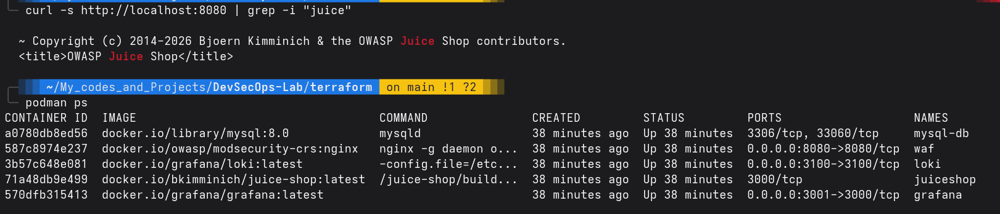
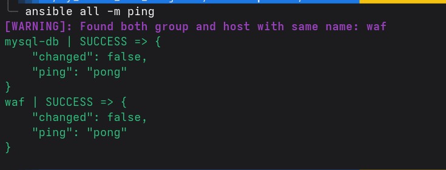

# Encountered Problems & Resolutions (Troubleshooting)

This document traces the major errors encountered during deployment and details the resolution approach (Root Cause Analysis).

---

## 1. WAF: Nginx "Permission denied" on logs

### The exact problem
During initial deployment via Terraform, the WAF container (`owasp/modsecurity-crs:nginx`) refused to start or was restarting in loops.
Analysis of container logs (`podman logs waf`) displayed the following critical error:
`nginx: [emerg] 1#1: open() "/var/log/nginx/access.log" failed (13: Permission denied)`

### How the problem was identified
The `Permission denied` error on a log file is the absolute symptom of a permissions conflict between the host Linux filesystem and the internal container user.
Analyzing the `main.tf` code, we had used a **Bind Mount** (direct mounting of a host folder):
```hcl
  volumes {
    host_path      = abspath("${path.module}/../logs/waf")
    container_path = "/var/log/nginx"
  }
```
The official ModSecurity CRS image applies security best practices: it runs the Nginx process with an unprivileged user (the `nginx` user, UID 101) instead of the `root` user.
However, the local folder `../logs/waf` on the host machine was owned by the current user (UID 1000). When Nginx (UID 101) tried to write to it, the Linux filesystem blocked the action.

### The Solution
We replaced the *Bind Mount* with a **Named Docker Volume**.
In Terraform, we declared the `docker_volume` resource and modified the container's `volumes` block:
```hcl
resource "docker_volume" "waf_logs" {
  name = "waf-logs"
}
# ...
  volumes {
    volume_name    = docker_volume.waf_logs.name
    container_path = "/var/log/nginx"
  }
```

### Why this solution and what to remember
A Named Volume is managed entirely by the Docker/Podman daemon, stored in a dedicated system space (often in `/var/lib/docker/volumes` or equivalent Podman). When initializing the container, the engine automatically adjusts permissions to ensure the internal user can write to it. This is the "DevOps" reference approach for persisting data without running into host-related permission issues.

### With native Docker?
If we had used Docker (in root daemon mode) instead of Podman, **the problem would have been similar, though sometimes masked**.
On a purely Linux system, the error would have been exactly the same because UID 101 remains UID 101. However, if we had used Docker Desktop (on Windows or macOS), the intermediate VM (WSL2 or HyperKit) often dynamically adjusts Bind Mount permissions on the fly. This hides errors and gives a false sense of security, but the code would fail brutally once deployed on a real production Linux server! Being on Linux/Podman forced you to adopt the robust solution from day one.

---

## 2. WAF: Connection reset by peer (curl Error 56)

### The exact problem
Once the permissions problem was resolved, the WAF was in `Up` status. However, any attempt to connect to it (`curl -s -i http://localhost:8080`) failed with a network error:
`curl: (56) Recv failure: Connection reset by peer`

### How the problem was identified
A *Connection Reset* (TCP RST packet) from localhost to a container means that the Docker engine properly intercepted the incoming traffic on the exposed port, transferred it inside the container network, but **no application process was listening on the other side**. The container's operating system then forcefully closes the connection.
Analysis of `main.tf` revealed the problem in the port mapping:
```hcl
  ports {
    internal = 80
    external = 8080
  }
```
Remember from our earlier analysis: the image runs with a non-root user. On Linux, a non-root user cannot open ports below 1024 (it lacks the `CAP_NET_BIND_SERVICE` capability). The CRS image developers therefore configured Nginx to listen by default on HTTP port **8080** internally, not 80.
Our external traffic was arriving on internal port 80, which was empty!

### The Solution
We corrected the mapping to align with the internal configuration of the CRS image:
```hcl
  ports {
    internal = 8080
    external = 8080
  }
```

### Why this solution and what to remember
It is essential to always distinguish between the **external** port (the one exposed to the world / your browser) and the **internal** port (the one defined in the image's `Dockerfile` via the `EXPOSE` instruction or software configuration).
Golden rule in security: "Hardened" or "Rootless" containers will systematically use high ports (8080, 8443) to bypass privileged port restrictions.

### With native Docker?
The behavior would have been **strictly identical** with any version of Docker. Port forwarding is a universal container networking mechanism. If you redirect traffic to a port where nothing is running, a `Connection reset` is the standard behavior of a healthy TCP/IP stack.

### Final state after resolution
- Named volume `waf-logs` managed by Podman
- Corrected port mapping: `internal = 8080, external = 8080`
- Validation: `curl -s http://localhost:8080 | grep -i "juice"` ✅
- `podman ps`: 5 containers Up ✅



---

## 3. Ansible: Unable to connect and execute modules on containers

### The exact problem
During the first connection tests from Ansible to target containers (`ansible all -m ping`), two major errors appeared:
1. On the WAF (`owasp/modsecurity-crs:nginx`): `Failed to create temporary directory [...] echo /nonexistent/.ansible/tmp`
2. On MySQL and WAF: `The module interpreter '/usr/bin/python3' was not found`

### How the problem was identified
- **For the temporary directory (WAF)**: By default, the `nginx` user running the container has no real home directory (`/nonexistent`). When Ansible tries to create its temporary working folder `~/.ansible/tmp`, the system denies access.
- **For the Python interpreter (WAF & MySQL)**: Ansible intrinsically relies on sending and executing Python scripts on target machines to run its standard modules (`ping`, `copy`, `mysql_db`, etc.). However, official Docker images such as `mysql:8.0` and `owasp/modsecurity-crs:nginx` are intentionally lightweight for security reasons (reducing attack surface) and therefore don't include Python by default.

### Solutions Deployed

#### 1. Temporary directory correction
We instructed Ansible to use the global `/tmp` temporary directory (which is writable by everyone) instead of the user's home directory.
- **Action**: Added the `remote_tmp = /tmp` variable in the `[defaults]` section of the `ansible.cfg` file.

#### 2. Python installation via `raw` module (Bootstrap)
To install Python without using modules requiring... Python (like the `apt` module), we wrote a "Bootstrap" playbook (`setup-python.yml`).
- This playbook disables initial variable collection (`gather_facts: no`).
- It uses the only native module that doesn't require Python on the target: the `raw` module. This module sends raw Bash commands via the Docker connector.
- **Action**: Installation of `python3` via `apt-get` (on the Debian-based WAF) and via `microdnf` (on the Oracle Linux-based DB), forcing connection under the root user (`ansible_user=root` in the inventory).

### Alternative approaches (Architectural)
The bootstrap via `raw` approach is practical, but in a strict GitOps/DevSecOps approach, other alternatives exist:
- **The "Custom Dockerfile" approach (Most recommended in production)**: Instead of pulling raw images in `main.tf`, we could have created a `Dockerfile` inheriting from official images and adding the `RUN apt-get update && apt-get install -y python3` instruction. Terraform would have then provisioned these new "Ansible-Ready" images. (Note: this would have required a `terraform apply` to destroy and recreate containers).
- **The "Local Connection" approach**: Use the `local` connection in Ansible with the `community.docker.docker_container_exec` module to execute commands from the host machine to containers, avoiding the need for Python inside. But this diverges from the classic Ansible experience.

### What to remember
A 100% containerized architecture quickly reveals hidden prerequisites of Configuration Management tools. Ansible is not "magic": it needs a runtime environment (Python) on its targets. Understanding the difference between a complete Linux system (VM) and a lightweight container is essential for any DevOps/SecOps engineer.



## 4. WAF | Playbook: Nginx syntax error in `nginx.conf` — `invalid number of arguments in proxy_pass`

### The exact problem
After the first `ansible-playbook waf-setup.yml`, the `Reload Nginx` handler triggered a fatal error preventing the config from being applied:
```
nginx: [emerg] invalid number of arguments in "proxy_pass" directive in /etc/nginx/conf.d/default.conf:25
```

### How the problem was identified
The `nginx -T` command (config test) allowed isolating the problematic line. Inspecting it in `ansible/files/waf/nginx.conf`, the `proxy_pass` directive contained a stray backslash before the end-of-line semicolon:
```nginx
# WRONG (generated by text editor)
proxy_pass http://juiceshop:3000\;

# CORRECT
proxy_pass http://juiceshop:3000;
```
The backslash `\` is a valid escape character in some languages (shell, Python), but **it has no meaning in Nginx syntax** and is therefore treated as an illegitimate additional character, transforming the directive into an instruction with "too many arguments".

### The Solution
Removal of the stray backslash in `ansible/files/waf/nginx.conf`.

### What to remember
In Nginx, the semicolon `;` is the directive terminator. It should never be escaped. This type of bug is classic when writing config in a code editor that confuses language contexts.

---

## 5. WAF | Playbook: Unknown Nginx variable `$modsec_inbound_anomaly_score`

### The exact problem
Even after fixing the `proxy_pass` syntax, Nginx reload failed with:
```
nginx: [emerg] unknown "modsec_inbound_anomaly_score" variable
```

### How the problem was identified
The JSON `log_format` defined in `nginx.conf` referenced two ModSecurity variables: `$modsec_inbound_anomaly_score` and `$matched_var`. These variables are injected into Nginx via the `ngx_http_modsecurity_module` dynamic module. When this module is not loaded **before** the `http` block evaluation, or if the variables haven't been declared yet, Nginx refuses to start.
The `owasp/modsecurity-crs:nginx` image does load ModSecurity, but the connector doesn't guarantee the exposure of all internal ModSecurity variables to the standard Nginx variable namespace.

### The Solution
Removal of the two problematic variables from the `log_format` in `nginx.conf`. The JSON log retains the essential fields for Grafana/Loki analysis:
- `time`, `remote_addr`, `method`, `uri`, `status`, `body_bytes`, `http_referer`, `http_user_agent`

### What to remember
To enrich logs with the ModSecurity score (a real value addition for an SOC dashboard), you must use the **ModSecurity audit log** (`/var/log/modsec_audit.log`), which is a separate file managed by the ModSecurity engine itself. Promtail can be configured to scrape it in Phase 3.

---

## 6. WAF | Playbook: `pkill`, `ps`, `pgrep` not found in image

### The exact problem
All process inspection or termination commands failed in the WAF container:
```
Error: crun: executable file `pgrep` not found in $PATH: No such file or directory
Error: crun: executable file `ps` not found in $PATH: No such file or directory
```
Concretely, the Ansible task `pkill promtail || true` would have silently failed on `pkill` without the `|| true`, and manual verifications were impossible.

### How the problem was identified
The minimal Debian image (`owasp/modsecurity-crs:nginx`) installs only what's strictly necessary to run Nginx. The utilities `ps`, `pgrep` and `pkill` are part of the `procps` package which is not included.

### The Solution
Added the `procps` package to the list of dependencies installed by the `waf-setup.yml` playbook, alongside `unzip`:
```yaml
- name: Download "unzip" and "procps" (for pkill)
  package:
    name:
      - unzip
      - procps
    state: present
```

### What to remember
Grouping system dependency installations in a single `package` task with a list is an Ansible best practice (single apt transaction, idempotent, more readable).

---

## 7. WAF | Playbook: Nginx logs symlinked to `/dev/stdout` — Promtail can't read them

### The exact problem
During validation tests, the command `podman exec waf cat /var/log/nginx/access.log` hung indefinitely and returned nothing. Inspecting the directory revealed:
```bash
podman exec waf ls -la /var/log/nginx/
# lrwxrwxrwx. root root 11 May 19  access.log -> /dev/stdout
# lrwxrwxrwx. root root 11 May 19  error.log -> /dev/stderr
```
Promtail tried to "read" a file that was only a symbolic link to the container's standard output — a write-only pseudo-file. It could therefore never send a single log to Loki.

### How the problem was identified
This is a very common Docker convention: by default, images redirect application logs to `stdout/stderr` so the Docker (or Podman) daemon can collect them via `docker logs`. This is an excellent reflex for classic deployment, but it's **incompatible with a file collection agent** like Promtail, which needs real files to "tail".

### The Solution
Added an Ansible task executed before starting Promtail to replace symlinks with real empty files:
```yaml
- name: "WAF | Replace Nginx log symlinks with real files (for Promtail)"
  shell: |
    if [ -L /var/log/nginx/access.log ]; then rm /var/log/nginx/access.log && touch /var/log/nginx/access.log; fi
    if [ -L /var/log/nginx/error.log ]; then rm /var/log/nginx/error.log && touch /var/log/nginx/error.log; fi
    chown nginx:adm /var/log/nginx/access.log /var/log/nginx/error.log
  changed_when: false
```

### What to remember
When deploying an observability stack (Promtail, Filebeat, Fluentd…) on Docker containers, **always check if logs are real files or symlinks to stdout/stderr**. This is an almost systematic pitfall with official images.

### Final state after resolving all WAF errors (Phase 2)
- Nginx reloads correctly without syntax errors ✅
- JSON config active, requests generate structured logs ✅
- `pgrep` and `pkill` available in the container ✅
- Logs in real files, readable by Promtail ✅

**Validation:**
```bash
# Test request through the WAF
curl -s http://localhost:8080/rest/products/search\?q\=test
# → JSON response from Juice Shop ✅

# Generated JSON log
podman exec waf cat /var/log/nginx/access.log | tail -1
# → {"time":"2026-06-17T07:15:57+00:00","remote_addr":"10.89.2.3","method":"GET","uri":"/rest/products/search?q=test","status":200,...}

# Active Promtail
podman exec waf pgrep -a promtail
# → 2246 /usr/local/bin/promtail -config.file=/etc/promtail-config.yml ✅
```

---

## 8. DB | Playbook: Incorrect MySQL password in vault — `Access denied for user 'root'`

### The exact problem
During the first execution of the `db-hardening.yml` playbook, the task to remove anonymous users failed immediately:
```
fatal: [mysql-db]: FAILED! => {}
MSG: unable to connect to database, check login_user and login_password are correct
Exception message: (1045, "Access denied for user 'root'@'localhost' (using password: YES)")
```

### How the problem was identified
The Ansible vault (`group_vars/all/vault.yml`) had been initialized with a test password (`SOCops@#`) instead of the real password used when creating the MySQL container by Terraform.

The real password was found using the container inspection command:
```bash
podman inspect mysql-db | grep -A 5 "Env"
# → "MYSQL_ROOT_PASSWORD=My_@password"
```
This command lists all environment variables of the container, including the root password passed by Terraform via the `MYSQL_ROOT_PASSWORD` variable.

### The Solution
Modified the `vault.yml` file (via `ansible-vault edit`) to align `mysql_root_password` with the value actually passed to Terraform in `terraform.tfvars`.

### What to remember
Terraform secrets and Ansible secrets are two distinct systems. **You must ensure from the start that the same password value is declared in both places**, or better, have only one source of truth (see entry #10 for alternative approaches).

---

## 9. DB | Playbook: `audit_log` plugin missing — MySQL Community Edition

### The exact problem
The task to install the audit plugin failed with a missing shared library error:
```
Cannot execute SQL 'INSTALL PLUGIN audit_log SONAME 'audit_log.so';' args [None]:
(1126, "Can't open shared library '/usr/lib64/mysql/plugin/audit_log.so'
(errno: 0 [...]: No such file or directory)")
```

### How the problem was identified
The `audit_log` plugin (as a `.so` file) is a feature **exclusive to MySQL Enterprise Edition**. The Docker image used (`mysql:8.0`) is the **Community Edition** distributed under GPL license, which doesn't include it.

**Existing alternatives for auditing in MySQL Community:**
| Method | Description | Drawback |
|--------|-------------|----------|
| `audit_log.so` | Native plugin, structured JSON/XML logs | **Enterprise only** |
| `general_log` | Log all SQL queries | **Extremely verbose**, severe performance impact, not recommended in production |
| **`component_validate_password`** | Password validation component (installed in this project) | Validation only, not auditing |
| **MariaDB Audit Plugin** | Open-source plugin, works with some MySQL versions | Compatibility not guaranteed with MySQL 8.0 |

`general_log` was mentioned as an option but intentionally rejected due to its excessive verbosity and performance impact.

### The Solution
The task to install the `audit_log` plugin and associated configuration tasks (`audit_log_policy`, `audit_log_format`) were **kept in the playbook but managed non-blockingly** via `failed_when`. The adopted audit strategy relies on:
- MySQL error logging (`log_error = /var/log/mysql/error.log`)
- The `validate_password` component to strengthen password policy
- WAF logs (Nginx + ModSecurity) to trace application-level attack attempts

### What to remember
Always check the Community vs Enterprise feature matrix of a DBMS before planning security controls. For a portfolio project, the conscious and documented choice of an alternative is worth as much as a perfect implementation.

---

## 10. 🔐 Security Reflection: Secrets exposed via `podman inspect`

### The observation
The command `podman inspect mysql-db | grep Env` allowed retrieving the MySQL root password **in plain text** from the output:
```json
"Env": [
  "MYSQL_ROOT_PASSWORD=My_@password",
  ...
]
```
This is the default behavior of Docker/Podman: environment variables passed to a container are stored in its metadata and accessible to any user with access to the Docker/Podman socket (i.e., by default, any member of the `docker` group or any rootless user on their own session).

### Why this is a real threat
In a shared environment (CI/CD server, shared dev machine), any user with access to Podman/Docker commands can exfiltrate all secrets of all containers in seconds. This is a critical post-exploitation attack surface.

### Security policies that could have been applied

#### 1. Never pass secrets via environment variables
Use **secret files mounted** as volumes, which are not exposed by `inspect`:
```hcl
# In main.tf: mount a secret file instead of passing an env var
volumes {
  host_path      = "/run/secrets/mysql_root_password"
  container_path = "/run/secrets/mysql_root_password"
  read_only      = true
}
```

#### 2. Docker/Podman Secrets (Swarm mode or Podman Secrets)
Podman has a native secrets mechanism that mounts the secret as an in-memory file (`tmpfs`) and doesn't expose it via `inspect`:
```bash
# Create the secret
echo "My_@password" | podman secret create mysql_root_password -

# Reference in the container (via --secret, not --env)
podman run --secret mysql_root_password,type=env,target=MYSQL_ROOT_PASSWORD mysql:8.0
```

#### 3. HashiCorp Vault (Enterprise approach)
Integrate a dedicated secrets manager (Vault) that dynamically delivers credentials at container startup, without ever storing them in metadata.

#### 4. Limit access to Podman/Docker socket
Apply the principle of least privilege: only strictly necessary users/processes should be able to execute `podman inspect` commands.

### Current state in this project
The password is managed via **Ansible Vault** (`vault.yml`) for the configuration part, which is correct. The weakness lies on the Terraform side: the password is passed via a Docker environment variable. For a portfolio project, this level is acceptable and documented. For real production, approaches 1 or 2 above would be mandatory.

---

## 11. Grafana: Automatic provisioning fails (Permission denied)

### Problem
The `/etc/grafana/provisioning/datasources/` folder is not readable from the Grafana container with Podman rootless.

### Workaround
Manual configuration of the Loki datasource via Grafana UI (URL: http://loki:3100). The datasource is persisted in Grafana's internal volume.

### Impact
Minor — the datasource is configured and functional. The `loki_datasource.yml` file remains in the repo for documentation but is not automatically loaded with Podman rootless.

---

## 12. WAF: All requests pass as HTTP 200 — WAF blocks nothing

### The exact problem

After complete deployment (Terraform + Ansible), the WAF was operational and logs were flowing well into Grafana/Loki. However, when running the attack simulation script (`simulate_killchain.sh`), **all malicious requests received HTTP 200 OK**. SQL injections, XSS, path traversals — nothing was blocked. The WAF acted as a simple pass-through reverse proxy.

Inspecting logs in Grafana showed requests with `200` status, as if no security rule had been triggered.

### How the problem was identified

Diagnosis followed a systematic approach, tracing the chain of responsibility:

#### Step 1 — Verifying CRS rules were loaded
```bash
podman logs waf 2>&1 | grep "rules loaded"
# → ModSecurity-nginx v1.0.4 (rules loaded inline/local/remote: 0/846/0)
```
846 rules loaded — this wasn't a problem of missing rules.

#### Step 2 — Checking ModSecurity engine mode
```bash
podman exec waf env | grep MODSEC_RULE_ENGINE
# → MODSEC_RULE_ENGINE=DetectionOnly
```
**First alert**: the engine was running in `DetectionOnly` mode. This mode specifies that ModSecurity should analyze traffic and log alerts, but **never block a request**, even if a rule is violated.

#### Step 3 — Tracing the actual config path loaded by Nginx
```bash
podman exec waf grep -r "modsecurity_rules_file" /etc/nginx/
# → /etc/nginx/conf.d/modsecurity.conf:
#   modsecurity_rules_file /etc/modsecurity.d/setup.conf;
```
Following the include chain:
```
/etc/nginx/conf.d/modsecurity.conf
  → modsecurity_rules_file /etc/modsecurity.d/setup.conf
    → Include /etc/modsecurity.d/modsecurity.conf     ← actual file
```
However, the Ansible playbook (`waf-setup.yml`) modified:
```yaml
- name: "WAF | Enable ModSecurity in blocking mode"
  lineinfile:
    path: /etc/nginx/modsecurity.d/modsecurity.conf   ← WRONG PATH
    regexp: '^SecRuleEngine'
    line: 'SecRuleEngine On'
```

**Second alert**: the playbook was editing `/etc/nginx/modsecurity.d/modsecurity.conf` while Nginx was loading **`/etc/modsecurity.d/modsecurity.conf`** (without the `nginx/` prefix). These are two different files in the image. The actually-loaded file was still in `DetectionOnly`:

```bash
podman exec waf grep SecRuleEngine /etc/modsecurity.d/modsecurity.conf
# → SecRuleEngine DetectionOnly    ← never touched by Ansible!
```

#### Step 4 — Analyzing CRS default actions
Even after fixing `SecRuleEngine On`, attacks still weren't blocked. Inspecting the `SecDefaultAction` in the CRS revealed the root cause:

```bash
podman exec waf grep "SecDefaultAction" /etc/modsecurity.d/owasp-crs/crs-setup.conf
# → SecDefaultAction "phase:1,pass,log,tag:'modsecurity'"
# → SecDefaultAction "phase:2,pass,log,tag:'modsecurity'"
```

**Third alert**: the CRS default actions were configured in `pass` mode. This means even if a rule detects an attack (incrementing the anomaly score), the final action was `pass` (forward the request) instead of `deny` (block with a 403). This is the intentional default behavior of the `crs-setup.conf` file shipped with the image — a deliberate choice by developers to let users explicitly define their blocking policy.

### The Solution

**3 corrections were applied:**

#### 1. Terraform — Container environment variable
The pass-through mode was also hard-coded in Terraform provisioning, making the container's initial configuration systematically `DetectionOnly`:

```hcl
# BEFORE (main.tf)
env = [
  "BACKEND=http://juiceshop:3000",
  "MODSEC_RULE_ENGINE=DetectionOnly",  # ← pass-through
]

# AFTER
env = [
  "BACKEND=http://juiceshop:3000",
  "MODSEC_RULE_ENGINE=On",            # ← active mode
]
```

This environment variable is used by the startup template of the CRS image (`/etc/nginx/templates/modsecurity.d/modsecurity.conf.template`) which generates the initial configuration at container startup. By passing `On` directly, the container is born directly in blocking mode.

#### 2. Ansible — Correcting the modsecurity.conf file path
The `waf-setup.yml` playbook was corrected to target the correct file:

```yaml
# BEFORE
- name: "WAF | Enable ModSecurity in blocking mode"
  lineinfile:
    path: /etc/nginx/modsecurity.d/modsecurity.conf   # ← non-existent
    regexp: '^SecRuleEngine'
    line: 'SecRuleEngine On'

# AFTER
- name: "WAF | Enable ModSecurity in blocking mode"
  lineinfile:
    path: /etc/modsecurity.d/modsecurity.conf          # ← actual file
    regexp: '^SecRuleEngine'
    line: 'SecRuleEngine On'
```

#### 3. Ansible — Forcing blocking in CRS default actions
A new task was added to override the `SecDefaultAction` pass → deny in `crs-setup.conf`:

```yaml
- name: "WAF | Force blocking (deny 403) in CRS default actions"
  lineinfile:
    path: /etc/modsecurity.d/owasp-crs/crs-setup.conf
    regexp: '^SecDefaultAction'
    line: 'SecDefaultAction "phase:{{ item }},log,deny,status:403,tag:'"'"'modsecurity'"'"'"'
  loop:
    - "1"
    - "2"
  notify: Reload Nginx
```

### Validation

```bash
# Test SQL injection
curl -s -o /dev/null -w "HTTP %{http_code}\n" \
  "http://localhost:8080/rest/products/search?q=test' UNION SELECT null--"
# → HTTP 403 ✅ Blocked

# Test XSS
curl -s -o /dev/null -w "HTTP %{http_code}\n" \
  "http://localhost:8080/rest/products/search?q=<script>alert('XSS')</script>"
# → HTTP 403 ✅ Blocked

# Test legitimate request (non-regression check)
curl -s -o /dev/null -w "HTTP %{http_code}\n" \
  "http://localhost:8080/rest/products/search?q=apple"
# → HTTP 200 ✅ Still OK

# Verify active configuration
podman exec waf grep SecRuleEngine /etc/modsecurity.d/modsecurity.conf
# → SecRuleEngine On

podman exec waf grep SecDefaultAction /etc/modsecurity.d/owasp-crs/crs-setup.conf
# → SecDefaultAction "phase:1,log,deny,status:403,tag:'modsecurity'"
# → SecDefaultAction "phase:2,log,deny,status:403,tag:'modsecurity'"
```

### Why this solution and what to remember

This problem perfectly illustrates the difference between a WAF in **Detection** mode and a WAF in **Prevention** mode — a fundamental security concept:

| Mode | Behavior | Usage |
|------|----------|-------|
| `DetectionOnly` | Analysis + Log | Initial deployment, rule validation, impact analysis |
| `On` | Analysis + Log + Blocking | Production, after rule validation and false positive tuning |

`DetectionOnly` mode is the best practice for initial WAF integration: it allows measuring the impact on legitimate traffic (false positives) before enabling blocking. **However, it is imperative to switch to `On` mode once the tuning phase is complete**, otherwise the WAF provides no real protection.

The incorrect path in the Ansible playbook (`/etc/nginx/modsecurity.d/` vs `/etc/modsecurity.d/`) is a classic pitfall of the `owasp/modsecurity-crs:nginx` image which maintains **two configuration directory trees**:
- `/etc/nginx/modsecurity.d/`: files generated from templates using environment variables (used as source by the entrypoint script)
- `/etc/modsecurity.d/`: actual files loaded by Nginx via the `modsecurity_rules_file` directive

The image uses a templating mechanism on first startup: files in `/etc/nginx/templates/` are copied and interpolated with environment variables (including `MODSEC_RULE_ENGINE`) to produce configuration in `/etc/modsecurity.d/`. Ansible must therefore target the actual destination files, not the template source files.

Finally, discovering `SecDefaultAction = pass` in `crs-setup.conf` reminds us that **CRS default actions are independent of `SecRuleEngine`**. You can have `SecRuleEngine On` (engine active) but `SecDefaultAction = pass` (no blocking action). Both parameters must be aligned for effective protection.

### With native Docker?
No impact: the problem is independent of the container engine. This is an application configuration error (wrong file path + CRS policy in pass-through mode), which would be identical under Docker, Podman, or containerd.
