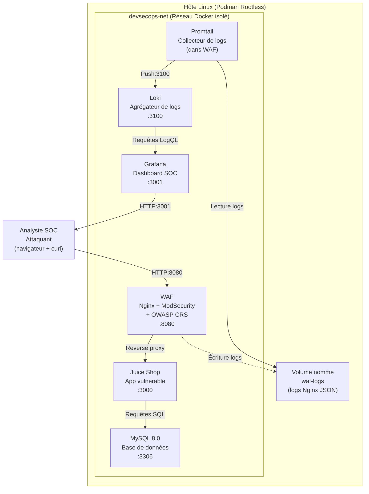

# Architecture du DevSecOps Lab

## Schéma d'architecture



## Flux de données

### Flux normal (requête légitime)
```
Utilisateur → localhost:8080 → WAF (Nginx + ModSecurity)
  → Analyse CRS (score normal) → Proxy inversé → Juice Shop
  → Log JSON dans /var/log/nginx/access.log
  → Promtail → Loki → Grafana (temps réel)
```

### Flux attaque bloquée
```
Attaquant → localhost:8080 → WAF (Nginx + ModSecurity)
  → Analyse CRS (score d'anomalie > seuil)
  → HTTP 403 Forbidden (bloqué)
  → Log JSON {status:403} dans access.log
  → Promtail → Loki → Grafana (alerte SOC)
```

## Stack technique

| Couche | Technologie | Rôle |
|--------|-------------|------|
| **Infrastructure as Code** | Terraform (provider Docker) | Provisionnement des 5 conteneurs, réseau, volumes |
| **Configuration Management** | Ansible + Ansible Vault | Configuration WAF, durcissement MySQL, déploiement Promtail |
| **Application cible** | OWASP Juice Shop | Application web volontairement vulnérable (Node.js) |
| **WAF** | Nginx + ModSecurity 3 + OWASP CRS | Reverse proxy, pare-feu applicatif, 846 règles de détection |
| **Base de données** | MySQL 8.0 | Backend de l'application Juice Shop |
| **Logging** | Promtail → Loki → Grafana | Collecte, agrégation et visualisation des logs de sécurité |
| **Simulation d'attaque** | SQLMap + Nmap + cURL | Kill chain automatisée (recon, SQLi, XSS, path traversal) |

## Conteneurs

| Conteneur | Image | Port exposé | Réseau | Volume |
|-----------|-------|-------------|--------|--------|
| `waf` | `owasp/modsecurity-crs:nginx` | `8080 → 8080` | devsecops-net | waf-logs → /var/log/nginx |
| `juiceshop` | `bkimminich/juice-shop:latest` | Aucun (via WAF) | devsecops-net | — |
| `mysql-db` | `mysql:8.0` | Aucun (interne) | devsecops-net | — |
| `loki` | `grafana/loki:latest` | `3100 → 3100` | devsecops-net | — |
| `grafana` | `grafana/grafana:latest` | `3001 → 3000` | devsecops-net | Provisioning datasource/dashboards |

## Sécurité (défense en profondeur)

1. **Réseau isolé** : Les conteneurs sont sur `devsecops-net`, Juice Shop et MySQL ne sont pas exposés directement
2. **WAF en mode blocage** : `SecRuleEngine On` + `SecDefaultAction deny:403` — les attaques sont bloquées avant d'atteindre l'application
3. **Logs JSON structurés** : Format `json_combined` pour une analyse LogQL efficace
4. **Durcissement MySQL** : Politique de mots de passe (MEDIUM), SSL/TLS obligatoire, bind localhost, suppression utilisateurs anonymes
5. **Secrets chiffrés** : Variables sensibles dans Ansible Vault
6. **Monitoring SOC** : Centralisation des logs WAF dans Grafana avec dashboard dédié

## Pipeline de déploiement

```bash
# 1. Installation des dépendances
./tests.sh

# 2. Provisionnement de l'infrastructure
terraform -chdir=terraform apply

# 3. Configuration des services
ansible-playbook ansible/playbooks/site.yml --ask-vault-pass

# 4. Simulation d'attaque
bash attack_simulation/simulate_killchain.sh

# 5. Analyse des logs dans Grafana
firefox http://localhost:3001
```
