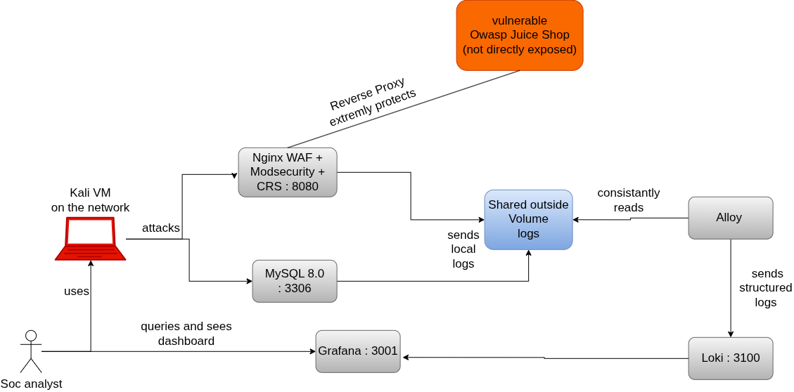
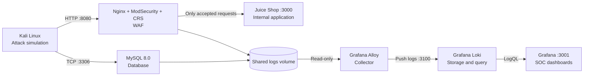

# DevSecOps Lab Architecture

## Architecture Overview

The lab is an isolated, containerized environment for testing web and database security controls. Terraform creates the containers, network, volumes, and initial database state. Ansible then applies security configuration. The architecture separates the vulnerable application, its database, the enforcement point, and the monitoring plane so that each control can be tested independently.

```mermaid
graph LR
    KALI["Kali Linux\nAttack simulation"] -->|HTTP :8080| WAF["Nginx + ModSecurity + CRS\nWAF"]
    WAF -->|Only accepted requests| APP["Juice Shop :3000\nInternal application"]
    KALI -->|TCP :3306| DB["MySQL 8.0\nDatabase"]
    WAF --> LOGS[("Shared logs volume")]
    DB --> LOGS
    LOGS -->|Read-only| ALLOY["Grafana Alloy\nCollector"]
    ALLOY -->|Push logs :3100| LOKI["Grafana Loki\nStorage and query"]
    LOKI -->|LogQL| GRAFANA["Grafana :3001\nSOC dashboards"]
```

## Layers and Responsibilities

### 1. Infrastructure and configuration layer

Terraform provisions six containers on the private `devsecops-net` bridge: the WAF, Juice Shop, MySQL, Alloy, Loki, and Grafana. It also creates the shared `logs` volume and mounts `init.sql` into MySQL. This makes the topology repeatable and ensures that security tests start from a known state.

Ansible is the configuration layer. It enables WAF enforcement, applies carefully scoped CRS exclusions, and hardens MySQL according to the intended CIS controls. Secrets are kept in Ansible Vault rather than in the architecture itself.

### 2. Network and attack layer

Kali Linux represents the tester. It has two separate paths:

- **Web path:** HTTP requests enter through the host's `8080` port and must pass through the WAF. Juice Shop has no host port, so it cannot be reached directly from outside the container network.
- **Database path:** TCP connections use host port `3306` and test authentication, encryption, and privilege controls on MySQL. This path intentionally exposes the database endpoint for validation; it is independent of the web path.

The private bridge permits service-to-service communication by container name while host port mappings define the deliberately exposed test interfaces.

### 3. Perimeter and application layer

Nginx is the reverse proxy and the only entry point for the web application. ModSecurity inspects HTTP requests, while the OWASP Core Rule Set (CRS) detects common attacks such as SQL injection, cross-site scripting, and path traversal. With `SecRuleEngine On`, requests that exceed the configured anomaly threshold are rejected with HTTP 403 before reaching the application.

CRS exclusions are narrowly scoped to avoid disabling protection globally. They preserve known legitimate application behavior without weakening unrelated rules.

Juice Shop is the intentionally vulnerable Node.js/Angular target. Its purpose is to provide realistic application traffic and attackable endpoints; it is not a security boundary. The WAF and network isolation protect the route to it.

### 4. Data layer

MySQL 8.0 stores the application's data and sample sensitive tables such as `customer_profile`, `inventory_ledgers`, and `app_configs`, initialized from `init.sql`. The database is reachable for controlled testing, but Ansible reduces its attack surface by removing anonymous users, restricting remote root access, requiring TLS, enforcing password validation, and disabling unsafe features such as `local-infile` and symbolic links.

These controls address different risks: authentication prevents unauthorised entry, privilege restrictions limit impact after entry, TLS protects credentials and data in transit, and server settings reduce abuse of database features.

### 5. Observability layer

The WAF writes access and security events to `/var/log/nginx`; MySQL writes connection, error, and query-related events under `/var/log/mysql`. Both locations are backed by the shared `logs` volume.

Grafana Alloy is a separate collector container. It mounts the volume read-only at `/var/log/lab`, tails the log files, adds useful source labels, and sends the records to Loki. Read-only access prevents the monitoring process from modifying protected logs and keeps collection independent of the WAF and database workloads.

Loki stores the log streams and supports LogQL queries. Grafana connects to Loki and presents dashboards for request status, blocked URIs, attack patterns, database events, and activity over time. This separation provides evidence of both successful and blocked activity without placing dashboard or collection logic in the application containers.

## End-to-End Data Flows

### Legitimate web request

1. A client sends an HTTP request to `localhost:8080`.
2. Nginx receives it and passes request data through ModSecurity and CRS.
3. If the request remains below the anomaly threshold, Nginx proxies it to `juiceshop:3000` on the private network.
4. The response returns through Nginx to the client.
5. Nginx records the request and response metadata in its access log.
6. Alloy reads the new record, sends it to Loki, and Grafana makes it queryable.

### Blocked web attack

1. A test payload, such as SQL injection, XSS, or path traversal, arrives at port `8080`.
2. ModSecurity and CRS match the payload and increase the request anomaly score.
3. Nginx returns HTTP 403 and does not proxy the request to Juice Shop.
4. The decision and request metadata are written to the WAF log.
5. Alloy forwards the event to Loki, where Grafana can show blocked counts, source activity, and targeted URIs.

### Database security test

1. Kali connects to `localhost:3306` and attempts the selected authentication or protocol test.
2. MySQL evaluates the connection against its users, privileges, TLS requirement, and server configuration.
3. The connection is accepted only when it satisfies the active controls; otherwise it fails and is logged.
4. MySQL events are collected from the shared volume by Alloy and sent through Loki to Grafana.

## Defense in Depth

The design combines network isolation, an enforced application firewall, a non-public application port, database hardening, least-privilege configuration, and independent log collection. No single layer is expected to stop every attack: the WAF limits web-layer exposure, MySQL controls direct database access, and the observability pipeline supplies evidence for validating both controls and failures.

## Container and Port Summary

| Container | Purpose | Host exposure | Important mounts |
|---|---|---|---|
| `waf` | Reverse proxy and HTTP inspection | `8080:8080` | `logs` at `/var/log/nginx` |
| `juiceshop` | Vulnerable web application | None | None |
| `mysql-db` | Application database and hardening target | `3306:3306` | `logs` at `/var/log/mysql`; `init.sql` for seed data |
| `alloy` | Read-only log collector | Internal `:12345` | `logs` at `/var/log/lab:ro`; Alloy configuration |
| `loki` | Log storage and LogQL API | `3100:3100` | Loki configuration/data as configured |
| `grafana` | Dashboards and SOC views | `3001:3000` | Datasource and dashboard provisioning |

