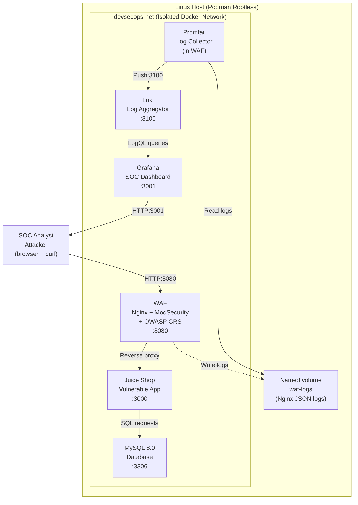

# DevSecOps Lab Architecture

## Architecture Diagram


```mermaid
graph TB
    subgraph "Linux Host (Podman Rootless)"
        subgraph "devsecops-net (Isolated Docker Network)"
            WAF["WAF
                Nginx + ModSecurity
                + OWASP CRS
                :8080"]
            
            JS["Juice Shop
                Vulnerable App
                :3000"]
            
            DB["MySQL 8.0
                Database
                :3306"]
            
            LOKI["Loki
                Log Aggregator
                :3100"]
            
            GRAFANA["Grafana
                SOC Dashboard
                :3001"]
            
            PROMTAIL["Promtail
                Log Collector
                (in WAF)"]
        end

        VOL["Named volume
            waf-logs
            (Nginx JSON logs)"]
    end

    USER["SOC Analyst
        Attacker
        (browser + curl)"]

    USER -->|HTTP:8080| WAF
    WAF -->|Reverse proxy| JS
    JS -->|SQL requests| DB
    WAF -.->|Write logs| VOL
    PROMTAIL -->|Read logs| VOL
    PROMTAIL -->|Push:3100| LOKI
    LOKI -->|LogQL queries| GRAFANA
    GRAFANA -->|HTTP:3001| USER
```

## Data Flow

### Normal Flow (Legitimate Request)
```
User → localhost:8080 → WAF (Nginx + ModSecurity)
  → CRS analysis (normal score) → Reverse proxy → Juice Shop
  → JSON log in /var/log/nginx/access.log
  → Promtail → Loki → Grafana (real-time)
```

### Blocked Attack Flow
```
Attacker → localhost:8080 → WAF (Nginx + ModSecurity)
  → CRS analysis (anomaly score > threshold)
  → HTTP 403 Forbidden (blocked)
  → JSON log {status:403} in access.log
  → Promtail → Loki → Grafana (SOC alert)
```

## Tech Stack

| Layer | Technology | Role |
|-------|-----------|------|
| **Infrastructure as Code** | Terraform (provider Docker) | Provisioning 5 containers, network, volumes |
| **Configuration Management** | Ansible + Ansible Vault | WAF config, MySQL hardening, Promtail deployment |
| **Target Application** | OWASP Juice Shop | Intentionally vulnerable web app (Node.js) |
| **WAF** | Nginx + ModSecurity 3 + OWASP CRS | Reverse proxy, application firewall, 846 detection rules |
| **Database** | MySQL 8.0 | Backend for Juice Shop app |
| **Logging** | Promtail → Loki → Grafana | Collection, aggregation and visualization of security logs |
| **Attack Simulation** | SQLMap + Nmap + cURL | Automated kill chain (recon, SQLi, XSS, path traversal) |

## Containers

| Container | Image | Exposed Port | Network | Volume |
|-----------|-------|-------------|---------|--------|
| `waf` | `owasp/modsecurity-crs:nginx` | `8080 → 8080` | devsecops-net | waf-logs → /var/log/nginx |
| `juiceshop` | `bkimminich/juice-shop:latest` | None (via WAF) | devsecops-net | — |
| `mysql-db` | `mysql:8.0` | None (internal) | devsecops-net | — |
| `loki` | `grafana/loki:latest` | `3100 → 3100` | devsecops-net | — |
| `grafana` | `grafana/grafana:latest` | `3001 → 3000` | devsecops-net | Provisioning datasource/dashboards |

## Security (Defense in Depth)

1. **Isolated Network**: Containers on `devsecops-net`, Juice Shop and MySQL not directly exposed
2. **WAF in Blocking Mode**: `SecRuleEngine On` + `SecDefaultAction deny:403` — attacks blocked before reaching the app
3. **Structured JSON Logs**: `json_combined` format for efficient LogQL analysis
4. **MySQL Hardening**: Password policy (MEDIUM), mandatory SSL/TLS, localhost bind, anonymous user removal
5. **Encrypted Secrets**: Sensitive variables in Ansible Vault
6. **SOC Monitoring**: Centralized WAF logs in Grafana with dedicated dashboard

## Deployment Pipeline

```bash
# 1. Install dependencies
./tests.sh

# 2. Provision infrastructure
terraform -chdir=terraform apply

# 3. Configure services
ansible-playbook ansible/playbooks/site.yml --ask-vault-pass

# 4. Run attack simulation
bash attack_simulation/simulate_killchain.sh

# 5. Analyze logs in Grafana
firefox http://localhost:3001
```
